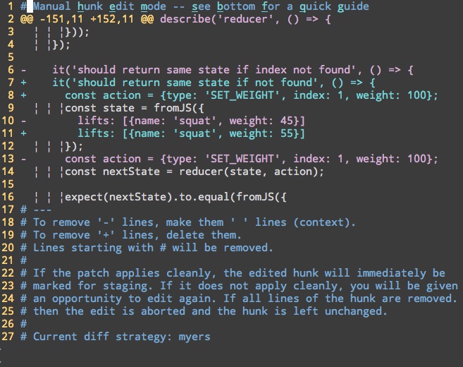

GitDiffSwitch.vim
=================

> A Vim plugin to toggle the [diff algorithm](https://git-scm.com/docs/git-diff) Git is using for the patch being edited via [git add --patch](https://git-scm.com/docs/git-add)

# Installing with [pathogen.vim](https://github.com/tpope/vim-pathogen)

```bash
git clone https://github.com/dustinspecker/git-diff-switch ~/.vim/bundle/git-diff-switch
```

# Usage

GitDiffSwitch.vim adds the `GitDiffSwitch` command for easily toggling the diff algorithm being used.

# Demo



# License

MIT © Dustin Specker 
